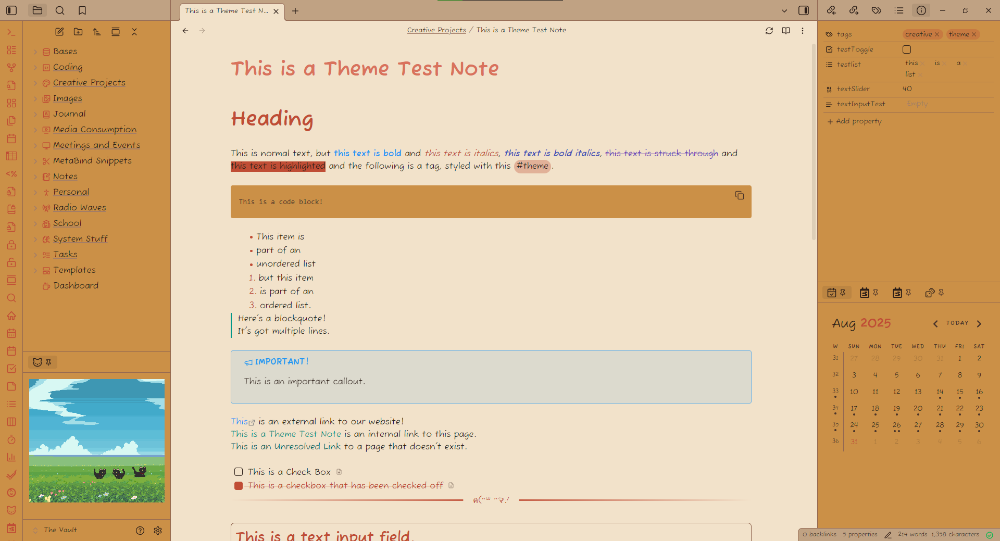
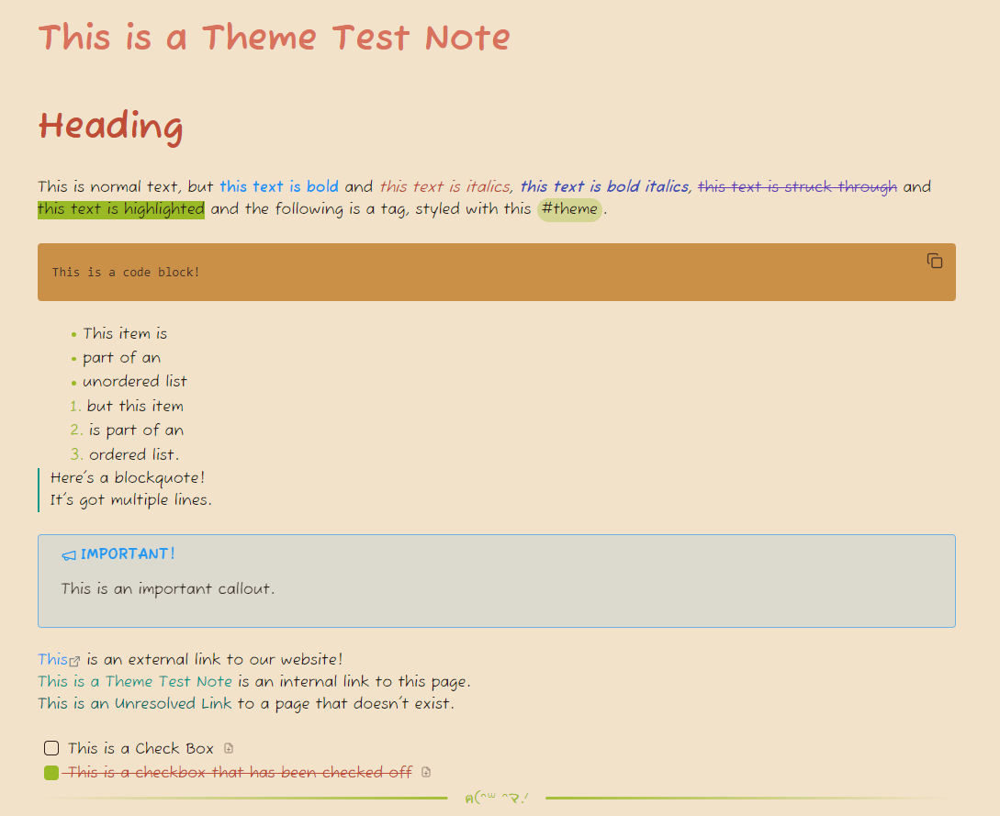
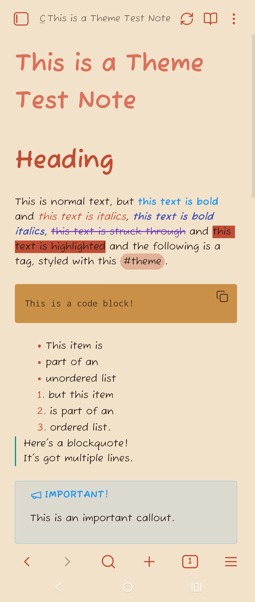
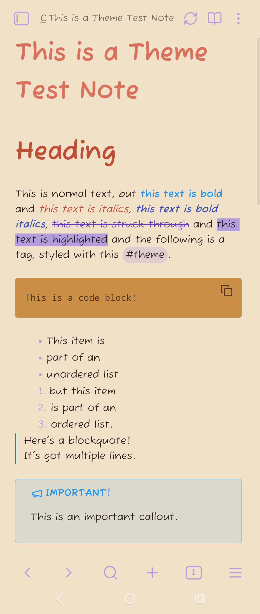
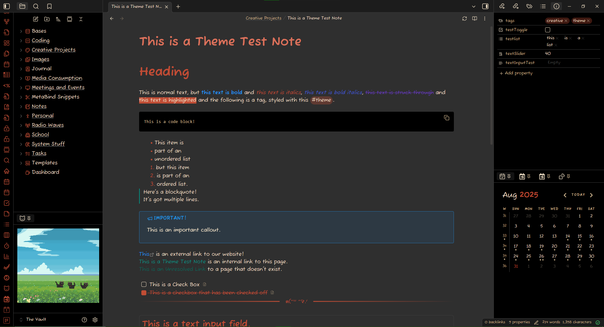
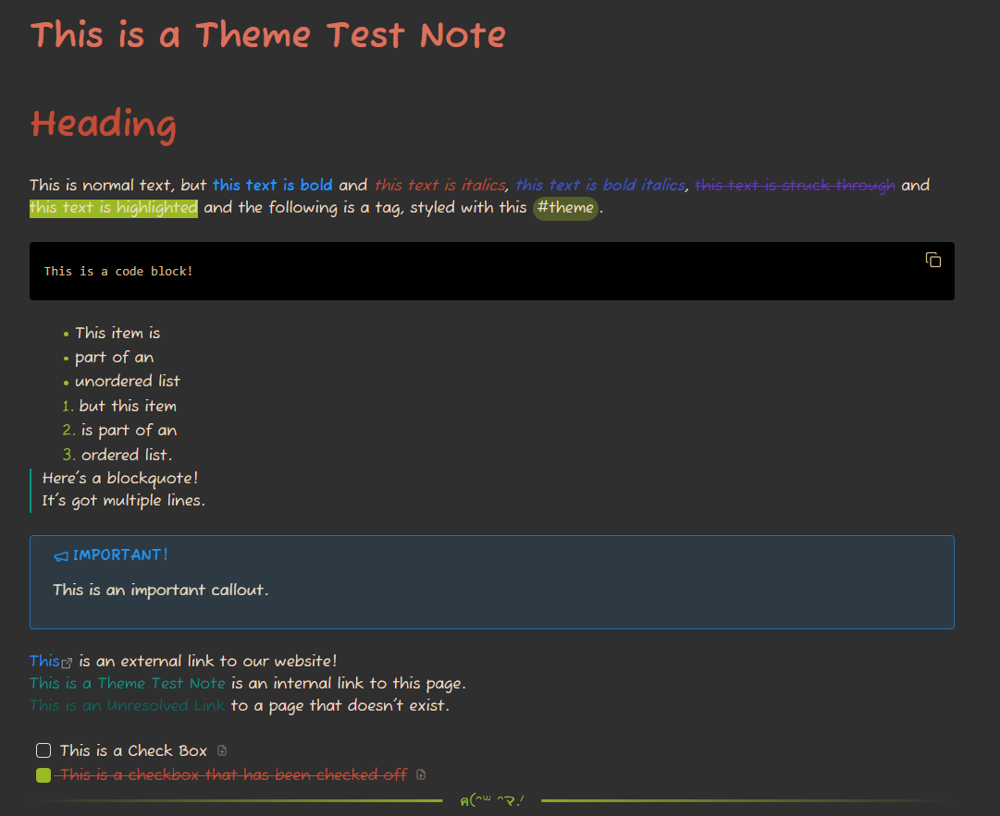
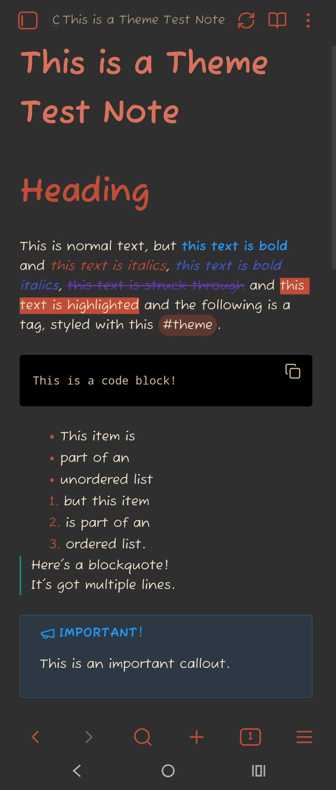
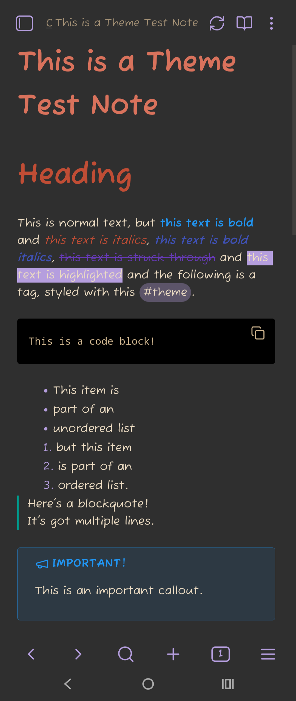

# Welcome
Welcome to the Maneki-Neko theme for [Obsidian](https://obsidian.md). This is a learning experience and theme that will (hopefully) someday be on the Obsidian theme gallery.
This theme was made with love to invoke the image of *maneki-neko*, Japanese lucky cat statues. These statues are often found in the entrances of businesses to bring good fortune and luck to the business. They often have a beconing paw raised, inviting prospective customers in to take a look at the business.

## Support
If you like this theme, please consider supporting me!  
https://ko-fi.com/7eahaus  
https://buymeacoffee.com/7eahaus  
Any questions or issues should be directed towards the GitHub page (https://github.com/7eahaus/maneki-neko), or you can find me in the Obsidian Members Group Discord (https://discord.gg/obsidianmd). 
  
Special thanks to all the members of the Obsidian community who have provided feedback and helped me build and test this theme, especially Kapirklaa.

## Plugin Support
Maneki-Neko currently supports a variety of plugins, most notably **Style Settings**, **Calendar**, **TaskNotes**, **MetaBind**, **Dataview**, and may include basic support for other plugins.

## Images
### Light Theme
Light Theme Default
 

 
Light Theme with the Safety Accent
 

 
Light Theme Default Mobile
 

 
Light Theme Lavender Accent Mobile
 

### Dark Mode
Dark Theme Default
 

 
Dark Theme with the Safety Accent
 

 
Dark Theme Default Mobile
 

 
Dark Theme Lavender Accent Mobile
 

